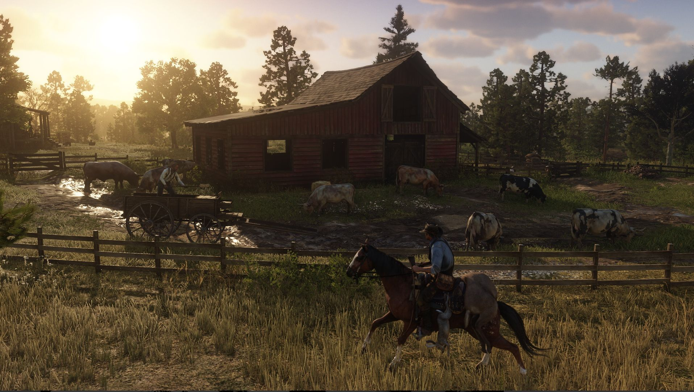
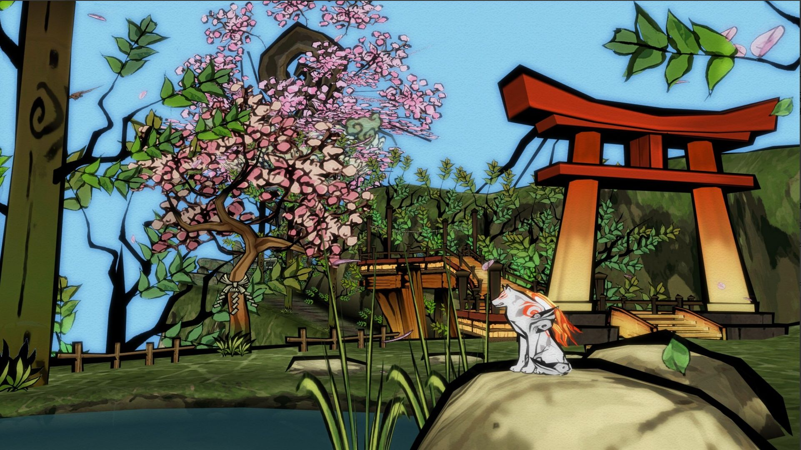
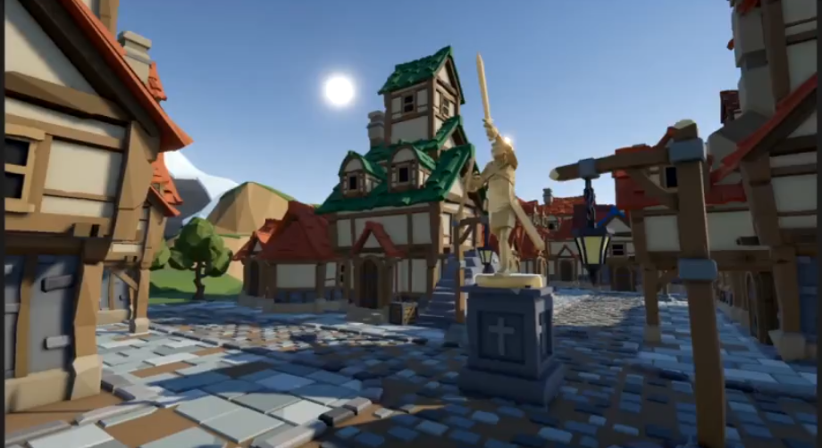
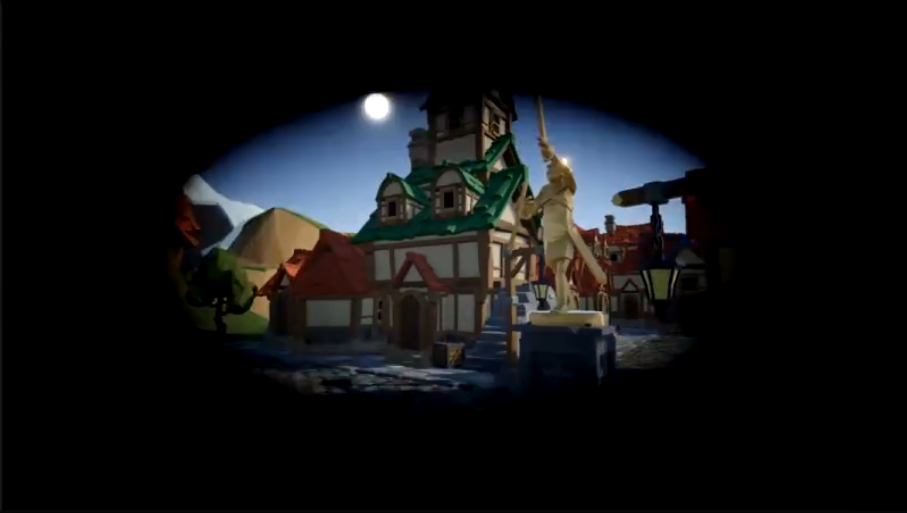
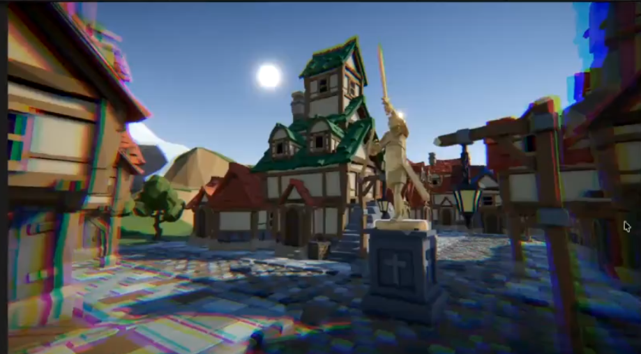
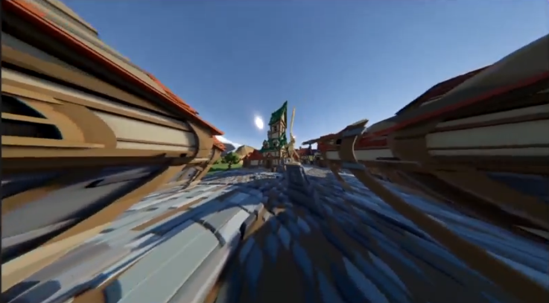
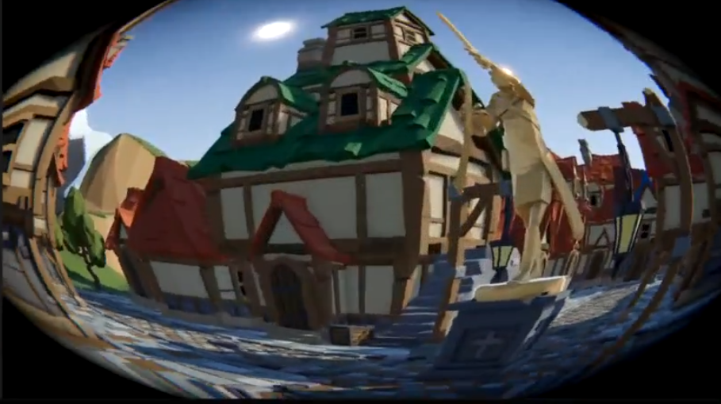
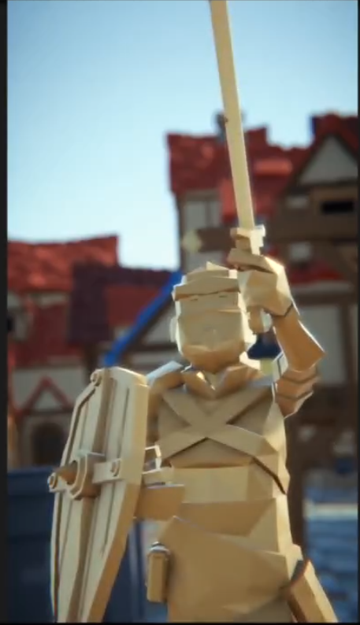

---
layout: post
title: "week 3 notes"
date: 2025-11-29
---
# Week 3 notes
The notes of the week 3 class about computer graphics.

## Part one: visual style
This class focus on the basic aesthetic knowledge. For people want to work for creating games, they need to master how to analyze the visual of different kinds of games and how to make it. Here are some terms people used to discuibe the visual style of a scene or an image: color model (HSV), model complexity, and dynamic range.

### HSV: hue, saturation and value
HSV is used to discribe the color of a scene. "H" means hue, all the colors distributed on a ring, people can discribe the color by using the degree of the ring. "S" means saturation of the color. In general, the color with higher saturation will be more gorgeous, the color with lower saturation will be closer to the simple gray. If a scene want to be a realistic scene, we always set a low saturation to make the scene more actual. The range of the saturation is from 0 to 1. "V" means value, the brightness of the image. Additionally, we need to know that the "dark" doesn't discribe the hue of the color. A color may have a hue close to the black but uses a high value. The range of the value is from 0 to 1. Now, we can have some example to try to use HSV to discribe a scene:

We use a scene of Genshin impact as a example. From this scene we can extract some color and discribe them using HSV. The red of accessory is (357, 0.77,0.82). First date is the degree of the hue, determing which color it use. Second data is the saturation of the color, when it close to 1, we can say that this color has high saturation. The last data is the value, when it close to 1 we can say that the brightness of this color is high. Significantly, in this scene, the leaves in the background is a classical example of the value. Although it looks very dark, but actually the value of it is 0.3, so the "dark" just because it uses a hue close to black. In this scene, we can discover that the range of value (maybe 0.3-0.77) is not very large. As a result, the dynamic range of it is impossible to be large, which we will cover in the next paragraph.

### Dynamic range
Dynamic range is a term to discribe the quantity of color layers of the details. For example, if a scene have high dynamic range, it will have many color layers such as different levels of dark. This parameter is important for judge if a game is realistic. A realistic game always has a large dynamic range to show the details in the different lighting conditions. We can use the scene of Red Dead Redemption 2 as an example:

In this scene we can see more than 70% of the image is dark but you can see many details in different values insteaded of a entire black, these details also improve the sense of reality.

### Model complexity
Another parameter we always use to mersure the sense of reality is the model complexity. It represents how many faces of each object. As we all know, if a game object has more faces, it will become smoother and closer to the real world objects. The scene of Red Dead Redemption 2 is looked real because everything is smooth, such the caw, horse and human. Here is an example with low model complexity, we can find the difference easily:

In this scene, all the objects have low model complexity which makes the whole scene like a cartoon but not a real world scene. Moreover, everything in this scene have high saturation and high value, make the game has a fantasy style.

Overall, we can use HSV, dynamic range and model complexity to correctly discribe a visual style of a scene. Usually, people will use less hue, low saturation amd high dynamic range to make the scene more actual, and use another side to make it more stylistic. Visual style should be vary, it's a way to present personal aesthetic.

## Part two: Processing
In this section we will introduce some techniques in the unity to adjust the visual style.

### For camera
First of all, we need to click the "post processing" in the camera to make sure the step after that will work. Click anti-alising and choose FXXA (for static scene) or TAA (for dynamic scene). Following that, click the physical camera then we can see some attributes in it. Sensor size is the first thing we need to caring about. We need to remember some usual size: medium format $(43.8*32.9mm)$, full frame $(36*24mm)$, APS-C $(23.6*25.6mm)$, phone camera$(5.76*4.29mm)$. Second important thing is the focus length. If it is lower than 24mm, we call that wide angle. If it is higher than 70mm, we call that long-focus. If you want to set a first-person perspective shot, your focus length should in the range from 14mm to 24mm.

### For volume
You need to create a empty game object and name it "volume". Inside of it, click "Add Component" and add a volume. Create a new volume profile, which will really record the post processing. However, if you already have had a volume, when you click the "new" the profile of that volume will also link to this volume, so remember to create a new profile insteaded of just click the botton. 

After that, click the "Add Override--post-processing--color adjustments" and "Add Override--post-processing--Tonemapping". We need to set the tonemapping to ACES to change the display from HDR to LDR. This action also causes the display to be darker, That's why we use the post exposure to raise the brightness.

The next tool is bloom. Bloom is used to simulate the light volumetric scattering. For example, if we create a luminous sphere in the scene, we can see the halo of this sphere. One important parameter of it is intensity (Usually, we just use the range from 1 to 3), we can enlarge the halo by increasing the intensity. 

The third one is the vignette. We can use two picture below to understand the useage of it. Before we use it, the scene looks like this: 

After we increase the intensity, it will change to this:

Vignette can simulate the scene of people's eyes and make the scene more realistic.

The fourth tool is chromatic aberration. We can also use a picture to show the effect of it:

This feature belongs to the optical defect of the camera. If we use it, the scene will look like shot by the real camera.

The fifth tool is lens distortion. If we set the intensity to a negative value, the scene will become to this:

If we set the value to the positive value, it will change to this:

As the same as the chromatic aberration, it is also the optical defect of the camera. Sometimes we also use it to make the scene wider.

Now we contrate on the changing color. the first tool is white balance. The left side of temperature is cold color and the right side of it is warm color. The left side of tint is green and the right side of it is purple.

Back to the color adjustment, post exposure can change the amount of light entering the camera. Adding contrast can enlarge the dynamic range, but if you add to much it will narrow the dynamic range, so people will use it cautious. Color filter will cover a color on the scene. Hue shift will change the hue of the scene, we can change a little when you want a unique style. Saturation can be used to change the style of the scene, we told it in the part one.

Lift gamma gain can change the brightness of the screen. Due to the difference of different screens, you should least it to the user to adjust it.

Next one is shadows, midtones and Highlights. Usually we increase the shadows to enlarge the dynamic range, and reduce the highlights to aviod overexposure. In terms of midtones, change it depends on your personal preference. You can also change the hue rings to change the color of shadow, midtones or highlight.

The last one is the depth of field. We can choose the boking mode directly. The most important attribute is aperture, lower aperture will make the background blurry, higher aperture will make the background clear. Focal length should be set as the same as the focus length of the camera, and we need to close to the target object otherwise anything in the scene will be blurry. Additionally, the effect of it will be unconspicuous when you are using a wide angle shot. If you want to shot the face of the people, you can set the focus length to 85mm, in this satuation you will see an obvious blurring effect, like this:

In this class, we have learned the elements of visual style and some post processing techniques in the unity.
